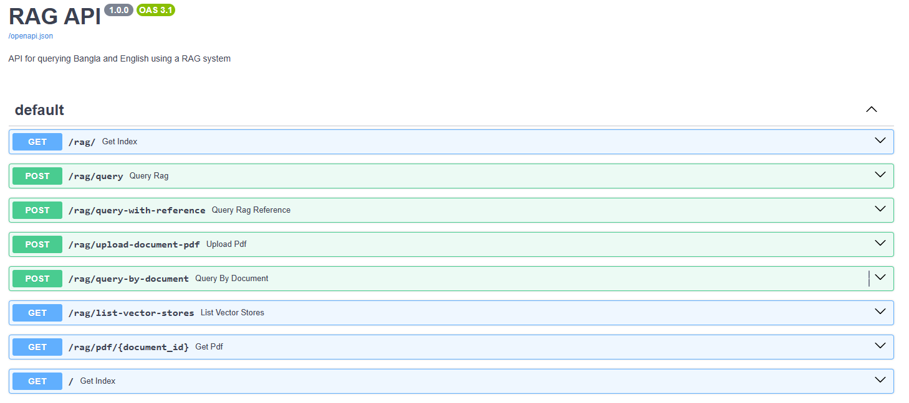

# Document Q&A RAG System with FastAPI

A powerful Document Question-Answering system built using `Retrieval-Augmented Generation (RAG)` architecture, `FAISS Vector Search`, and a `FastAPI` backend. It supports both Bengali and English for querying documents and provides context-aware answers. The system is also integrated with `Streamlit` for an interactive, user-friendly interface.

#### Web Application


#### Streamlit App


## Features

- 📄 PDF Document Processing
- 🔄 Multiple Text Extraction Methods (pdfplumber, pymupdf, langchain)
- 💾 Vector Database Storage using FAISS
- 🤖 RAG-based Question Answering
- 🌐 FastAPI Backend with Swagger Documentation
- 🖥️ Interactive Streamlit Frontend
- 📊 RAG System Evaluation Tools
- 🔤 Multi-language Support (Bengali & English)
- 📝 Detailed Logging System

## Project Structure
```
├── app/
│   ├── config/           
│   ├── core/            
│   ├── data/             
│   │   ├── pdfs/       
│   │   ├── texts/       
│   │   └── vectorstores/ 
│   ├── processing/      
│   ├── routes/         
│   ├── schemas/        
│   └── services/       
├── docs/               
├── logs/              
├── requirements.txt   
├── run.sh            
└── streamlit_app.py  
```

## Installation

1. Clone the repository:
```bash
git clone https://github.com/FaisalAhmedBijoy/Document-QA-RAG-System-FastAPI.git
cd Document-QA-RAG-System-FastAPI
```

2. Create and activate a conda environment:
```bash
conda create -n rag_llm python=3.12
conda activate rag_llm
```

3. Install dependencies:
```bash
pip install -r requirements.txt
```
4. Collect Groq API KEY from [Groq](https://console.groq.com/keys) and paste API KEY in the `.env` file.  
```bash
GROQ_API_KEY="YOUR_API_KEY"
```

## Key Dependencies

- **FastAPI**: Web framework for building APIs
- **Streamlit**: Frontend interface
- **LangChain**: Framework for developing LLM applications
- **FAISS**: Vector similarity search
- **Pydantic**: Data validation
- **PDF Processing**: pdf2image, `pdfplumber`, PyMuPDF

## Usage

1. Start the FastAPI backend:
   ```bash
   python -m app.main
   ```

2. Launch the Streamlit frontend:
   ```bash
   streamlit run streamlit.py
   ```

3. Access the applications:
   - FastAPI Swagger UI: http://localhost:8000/docs
   - Streamlit Interface: http://localhost:8501

4. Run using Docker:
   ```bash
   docker compose -f docker-compose.yaml up --build
   docker compose -f docker-compose.yaml up
   ```
## Processing Pipeline

1. **PDF Processing**
   - Convert PDF documents to text using multiple methods
   - Store extracted text in the `app/data/texts` directory
   ```bash
   python -m app.processing.pdf_to_text
   ```

2. **Text Chunking**
   - Split documents into manageable chunks
   - Optimize chunk size for better retrieval
   ```bash
   python -m app.processing.generate_text_chunks
   ```

3. **Embedding Generation and Vector Store**
   - Generate embeddings for text chunks. Embedding model used `l3cube-pune/bengali-sentence-similarity-sbert` from HuggingFace. 
   - Store vectors in FAISS index
      ```bash
      python -m app.processing.generate_embeddings
      python -m app.processing.generate_vector_db
      ```
   - Vector stored into `app/data/vectorstores/faiss_index`

4. **RAG Chain**
   - Retrieve relevant context using vector similarity
   - Generate answers using LLM with retrieved context. `Lllama-3.3-70b-versatile` LLM model used from [Groq](https://console.groq.com/docs/model/llama-3.3-70b-versatile). 
      ```bash
      python -m app.processing.generate_rag_chain
      ```
   - prompt used for this task
      ```python
      prompt_template = """
         You are an assistant that answers questions strictly based on the provided document text.

         Rules:
         - Only use the information from the given Context.
         - Do not use outside knowledge.
         - If the answer is not found in the Context, reply exactly: "Information not found in the document."
         - Provide only the answer, without repeating the question or the context.

         Context: {context}
         Question: {question}
         Answer:
         """
      ```
5. **Single Query Inference**
   - Run a query using LLM model
      ```bash
      python -m app.processing.single_query_inference
      ```
   - Perform question answering about the document
      ```json
      "query": "What is the email address of the candidate?",
      "answer": "faisal.cse16.kuet@gmail.com"
      ```

6. **API Endpoints**

      

    - `/rag/query`: Process questions and generate answers
        - Method: `POST`
        - Params
            ```json
            "query": "What is the name the candidate?",
            ```
        - Response
            ```json
            "query": "What is the name the candidate?",
            "answer": "Faisal Ahmed",
            ```
    
    - `/rag/query-with-reference`: Process questions and generate answers
        - Method: `POST`
        - Params
            ```json
            "query": "What is the job duration in Business Automation Limited?"
            "expected_answer": "Nov 2024 - Present",
            ```
        - Response
            ```json
            "query": "What is the job duration in Business Automation Limited?",
            "expected_answer": "Nov 2024 - Present",
            "actual": "November, 2024 - Present",
            "cosine_similarity": 0.8834819187419994,
            "context": [
               "[Doc 1]: • Developed cluster-based remark suggestions in a product • Developed a time series forecasting model for a product registration count. • Data analysis on project cost estimation in the company data and perform EDA. • Developed a website backend service using FastAPI and PostgreSQL that includes SMS and email sending modules, payment gateway integration, and custom PDF generation. Next Solution Lab, Dhaka, Bangladesh February, 2024 - October, 2024 AI Engineer • Developed deep learning-based prod",
               "[Doc 2]: Sentence Punctuation Restoration [GitHub] A transformer-based Bangla model was used to build the sentence punctuation model. Llama 3.2 was also used to infer with non-punctuation sentence correction. FastAPI was used to prepare the API for deployment with Docker. Tech Stack: BanglaBERT, LLM, Llama 3.2, FastAPI Chat Bot using LLM with Gradio [GitHub] The chatbot is built with Flask for the backend and uses a pre-trained model from Hugging Face for generating responses. Tech Stack: LLM, Gen AI, Fl",
            ]
            ```
   - `/rag/upload-document-pdf`: Upload PDF for generate new FAISS vector 
      - Method: POST
      - Params: `PDF File`
      - Response: FAISS vector saved `Document ID`. 
   
   - `/rag/query-by-document`: Process questions and generate answers based on document id
        - Method: `POST`
        - Params
            ```json
            "query": "What is the name the candidate?",
            "document_id": "1757268986878",
            ```
        - Response
            ```json
            "query": "What is the name the candidate?",
            "answer": "Faisal Ahmed",
            ```
   - `/rag/list-vector-storest`: Show the current vector list
        - Method: `GET`
        - Response
            ```json
            "vectors": {
               "vector_stores": [
                  "faiss_index_1757267758132",
                  "faiss_index_1757268986878",
               ],
               "document_ids": [
                  "1757267758132",
                  "1757268986878",
               ]
            }
            ```
   - `/rag/pdf/{ddocument_id}`: Show the PDF with document id
        - Method: `GET`

## Evaluation

The system includes evaluation tools to measure:
- Answer relevancy
- Response accuracy
- Retrieval quality

## Documentation

- API documentation available at `http://127.0.0.1:8000/docs` endpoint
- Sample outputs and UI screenshots in `docs/` directory
- Detailed logging in `logs/` directory

## Acknowledgments

- FastAPI 
- LangChain
- Streamlit
- FAISS
